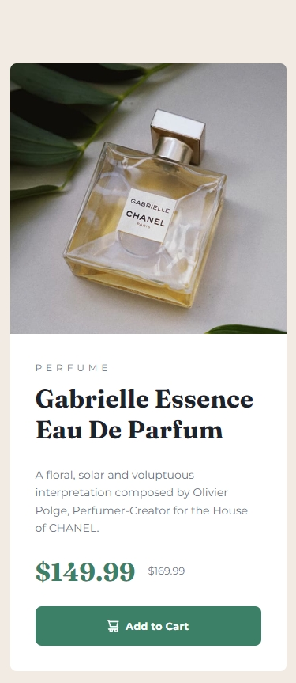
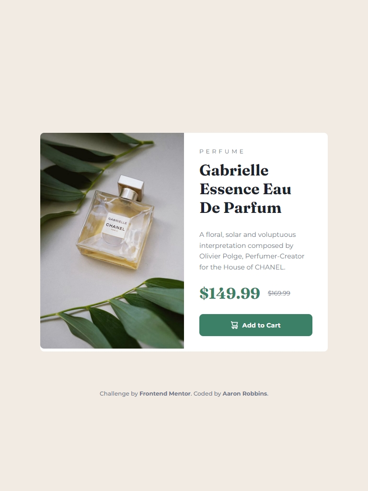
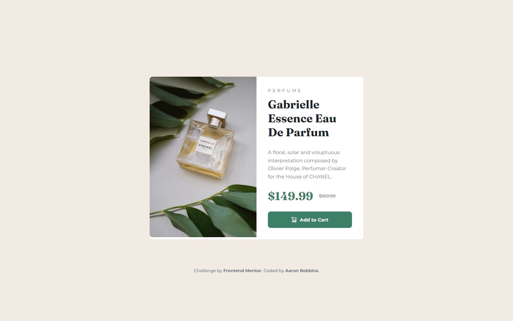

# Frontend Mentor - Product preview card component solution

This is a solution to the [Product preview card component challenge on Frontend Mentor](https://www.frontendmentor.io/challenges/product-preview-card-component-GO7UmttRfa). Frontend Mentor challenges help you improve your coding skills by building realistic projects.

## Table of contents

- [Overview](#overview)
  - [The challenge](#the-challenge)
  - [Screenshot](#screenshot)
  - [Links](#links)
- [My process](#my-process)
  - [Built with](#built-with)
  - [What I learned](#what-i-learned)
  - [Useful resources](#useful-resources)
  - [AI Collaboration](#ai-collaboration)
- [Author](#author)
- [Acknowledgments](#acknowledgments)

## Overview

### The challenge

Users should be able to:

- View the optimal layout depending on their device's screen size
- See hover and focus states for interactive elements

### Screenshot





### Links

- Solution URL: (https://www.frontendmentor.io/solutions/responsive-product-preview-with-hover-and-focus-states-bTnX7sITwn)
- Live Site URL: (https://freexm1nd.github.io/product-preview-card-component/)

## My process

### Built with

- Semantic HTML5 markup
- CSS custom properties
- Flexbox
- Mobile-first workflow

### What I learned

I used this challenge as an opportunity to refine my use of CSS custom properties. I think I did a better job this go around.

I learned about <picture> and how I can use it to use multiple instances of the same image in different image resolutions and different screen sizes, in tandem with media queries.

I learned about <del> and how some text elements can be used in place of CSS properties (text-decoration: line-through;).

Below is some code that reflects the things I learned above:

```html
<picture>
  <source
    srcset="./images/image-product-desktop.jpg"
    media="screen and (min-width: 768px)"
  />
  
</picture>

<p class="price">
  <span class="sale-price">$149.99</span>
  <del class="original-price">$169.99</del>
</p>
```

```css
:root {
  --black: hsl(212, 21%, 14%);
  --grey: hsl(228, 12%, 48%);
  --cream: hsl(30, 38%, 92%);
  --white: hsl(0, 0%, 100%);
  --green-500: hsl(158, 36%, 37%);
  --green-700: hsl(158, 42%, 18%);
  --spacing-40: 2.5rem;
  --spacing-32: 2rem;
  --spacing-24: 1.5rem;
  --spacing-16: 1rem;
  --spacing-8: 0.5rem;
  --spacing-4: 0.25rem;
  --font-size-32: 2rem;
  --font-size-14: 0.875rem;
  --font-size-13: 0.8125rem;
  --font-size-12: 0.75rem;
  --fraunces: "Fraunces", serif;
  --montserrat: "Montserrat", sans-serif;
}
```

### Useful resources

I continue to use Responsively to look at my designs on various screen sizes and to take screenshots.

- [Responsively App](https://responsively.app/)

### AI Collaboration

I used Claude in this challenge to assist in brainstorming solutions and to assist in debugging.

## Author

- GitHub - [Aaron Robbins](https://github.com/FREExM1ND)
- Frontend Mentor - [@FREExM1ND](https://www.frontendmentor.io/profile/FREExM1ND)

## Acknowledgments

I'm thankful for the team at Responsively for creating a useful development tool. Thank you to Frontend Mentor for the challenge. I'm eager to do more.
